# GAME BARGAINS

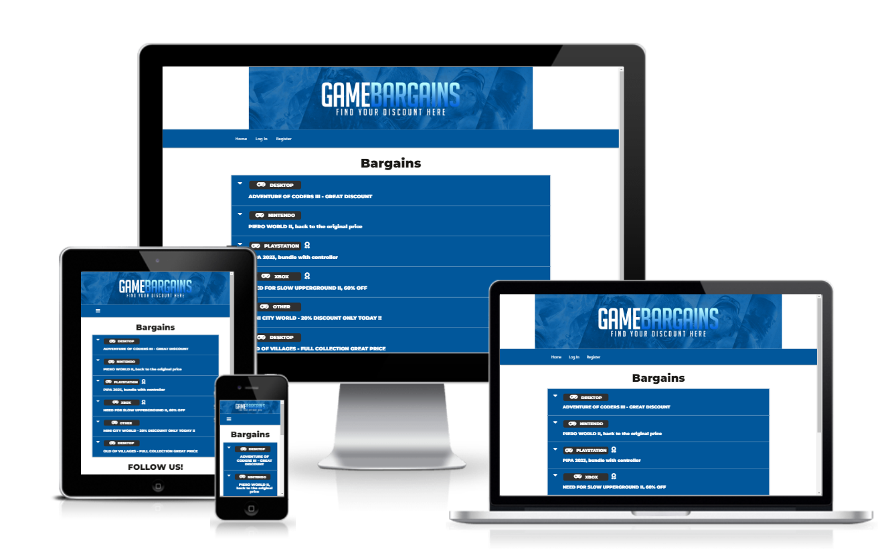

This comprehensive site was designed for a bargain site. The focus of the site is to provide a functional bargain site with a clean and modern design.

This is the third of four Milestone Projects that the developer must complete during the Full Stack Web Development Program at The Code Institute.

The main requirements were to make a responsive website that users can share their own data with the community and benefit from having convenient 
access to the data provided by all other members, create the back-end code and front-end form(s) to allow users to add new bargains to the site, 
edit them and delete them.

## UX

The purpose is to design an attractive website to share bargains and interact with it, with a simple and intuitive layout that works on mobiles, tablets or desktops.

## User Stories
### First Time Visitor Goals
1. As a first time visitor, I want to easily see the bargains.
2. As a first time visitor, I want to register and add my own bargain.

### Returning Visitor Goals
1. As a Returning Visitor, I want to check new bargains.
2. As a Returning Visitor, I want to manage my added bargain.
3. As a Frequent User, I want to be able to access your social media accounts.

### Frequent User Goals
1. As a Frequent User, I want to check the bargains daily.
2. As a Frequent User, I want to edit my bargain, delete when expired and report other bargains if necessary.

### Admin Goals
1. As an Admin User, I want to manage the Categories.
2. As an Admin User, I want to manage the Reports from users.
   

## Design
### Colour Scheme

- The main colours used are dark blue, white and black, to give the site a clean, modern and professional look.

### Typography

- The Montserrat font is used throughout the website with Sans Serif.

### Wireframes

#### index.html
1. [Desktop index.html](wireframe/desktopindex.png)

2. [Mobile index.html](wireframe/mobileindex.png)

3. [Tablet index.html](wireframe/tabletindex.png)

#### premium.html
1. [Desktop premium.html](wireframe/desktoppremium.png)

2. [Tablet premium.html](wireframe/tabletpremium.png)

3. [Mobile premium.html](wireframe/mobilepremium.png)

## Existing Features

### Navigation Bar

The navigation bar contains links to Home, Log In, Log Out, Register, Profile and New Bargain. When logged as Admin, Manage Categories and Reports pages available.

This section will allow the user to have an easier navigation from page to page across all devices without having to revert back to the previous page via the ‘back’ button.

### Footer

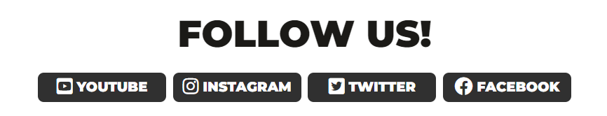

The footer provides the user links to the social media accounts (Youtube, Instagram, Facebook and Twitter).

### Home Page
- Logo

- Bargains (Logged off).

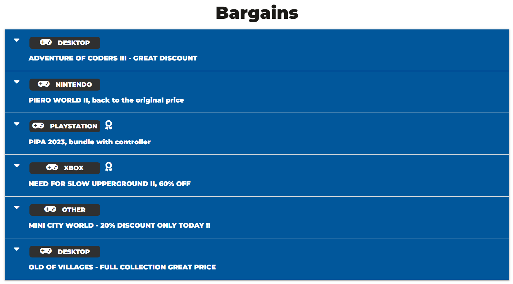

- Bargains (Logged In, buttons to edit or delete your own Bargain).

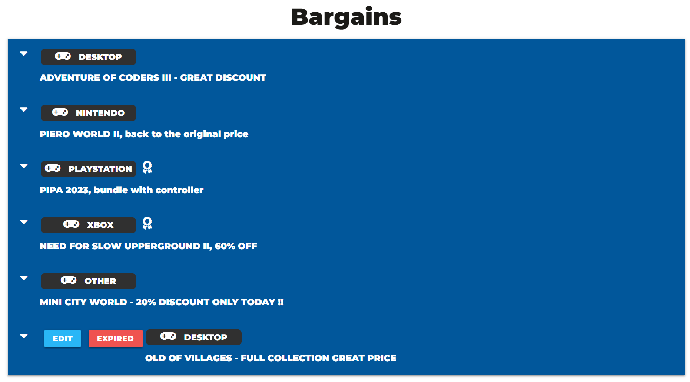

- When the user expand one of the bargains, the image, comment, link to the bargain, who created and report button will be available.

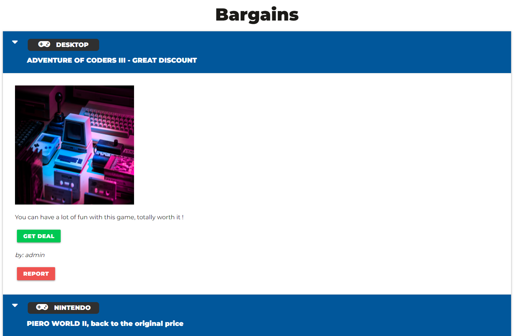

### Edit Bargain Page

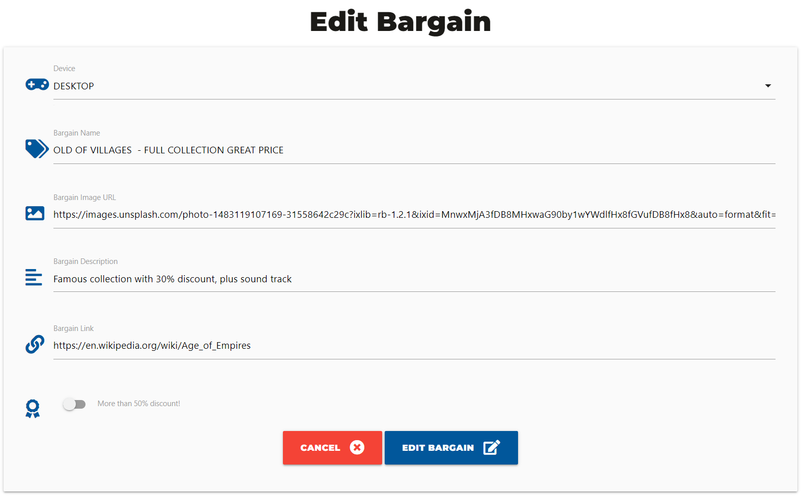

### Report Bargain Page

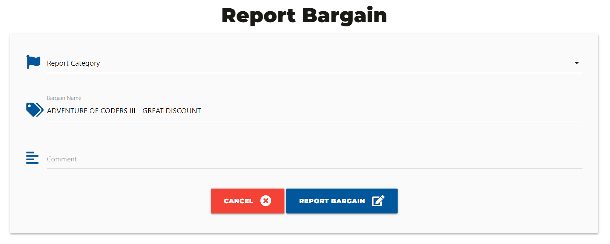

### Profile Page

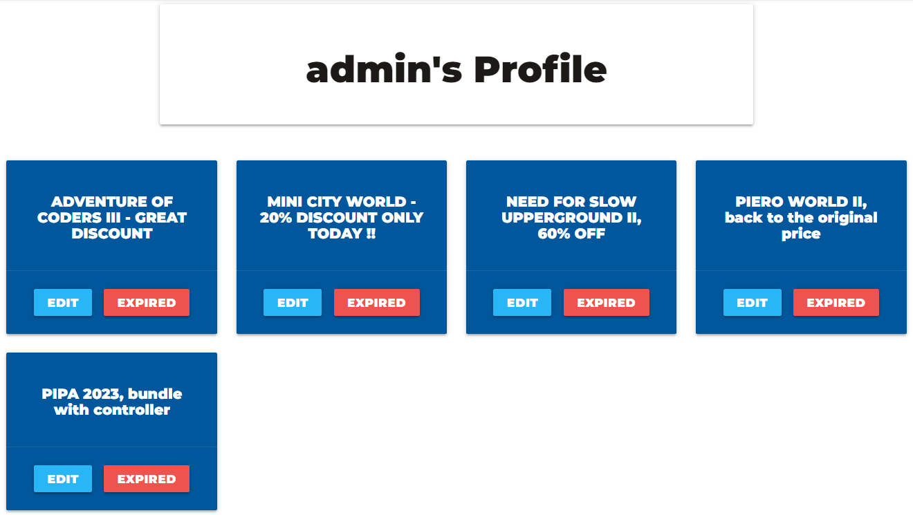

### New Bargain Page

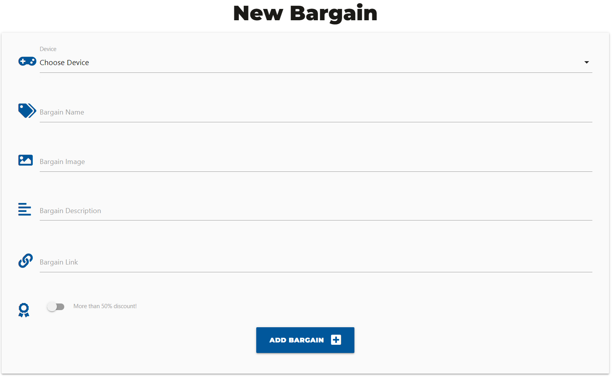

### Manage Categories Page

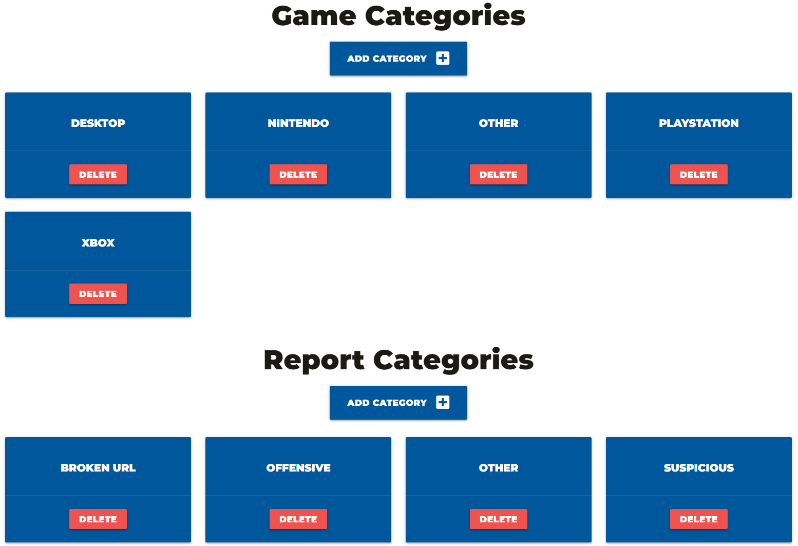

### Reports Page

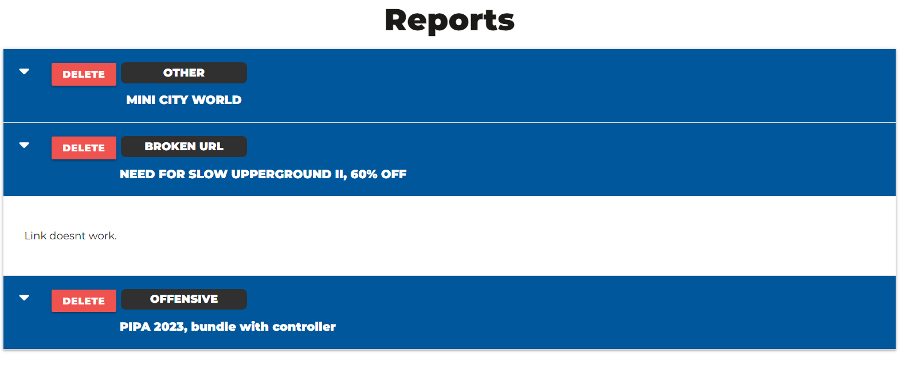

### Register Page

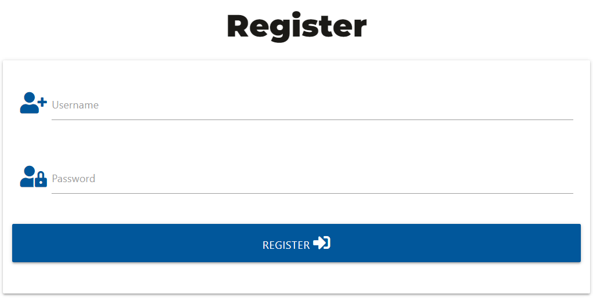

### Log In Page

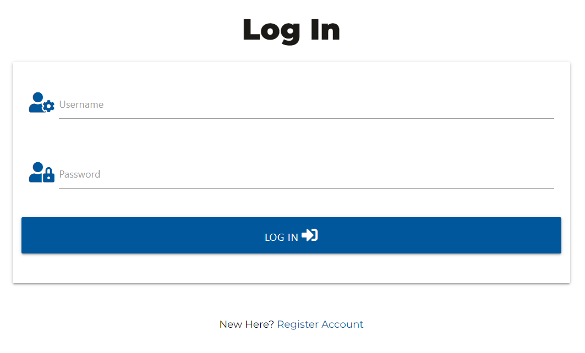

## Frameworks, Languages & Programs Used

### [VSCode](https://code.visualstudio.com/)
- This developer used VSCode for their IDE while building the website.

### [Materialize CSS](https://materializecss.com/)

- Materialize was used to build the NavBar, cards and collapsible itens.

### [Google Fonts](https://fonts.google.com/)
- The project uses Google fonts to style the website fonts.

### [Balsamiq](https://balsamiq.com/) 
- The project uses Balsamiq to create the wireframe mockups.

### [HTML 5](https://developer.mozilla.org/en-US/docs/Learn/Getting_started_with_the_web/HTML_basics)
- Markup language designed to be displayed in a web browser.

### [CSS 3](https://developer.mozilla.org/en-US/docs/Web/CSS)
- Style sheet language used for describing the presentation of a document in HTML.

### [JavaScript](https://www.javascript.com/)
- JavaScript is a scripting language used to create and control dynamic website content.

### [Python](https://www.python.org/)
- Python is commonly used for developing websites and software, task automation, data analysis, and data visualization.

### [Fontawesome](https://fontawesome.com/)
- Icons library and toolkit.

## Testing

### Development Testing

-  The Google Chrome Developer tools during the development of the website to inspect the site at different device sizes and in responsive mode.

### Manual Testing

- Navigation Bar
1. When each link on the navbar is clicked, it takes the user to the correct page.

- Social Media Links
1. When each link is clicked, it opens a new tab.
2. When each link is clicked, it takes the user to the correct page.

- Forms
1. When submitted the bargain or category is added to the database. 
2. Edit bargain function was tested multiple times by the developer.

- Log in and Register
1. Log in and Register working according to the pattern defined on code (A-Z, 0-9).
2. When registered, user is successfully added to the database, profile and permissions working accordingly.

- Report and Reports Page
1. When the user clicks on Report, data is loading properly and is added to the database.
2. The Admin can check all reports on Reports Page and delete them after review.

- Buttons
1. All the buttons have been tested multiple times.

### Code Validation

The W3C Markup Validator and W3C CSS Validator Services were used to validate the project to ensure there were no syntax errors in the project.

- W3C Markup Validator

- W3C CSS Validator 

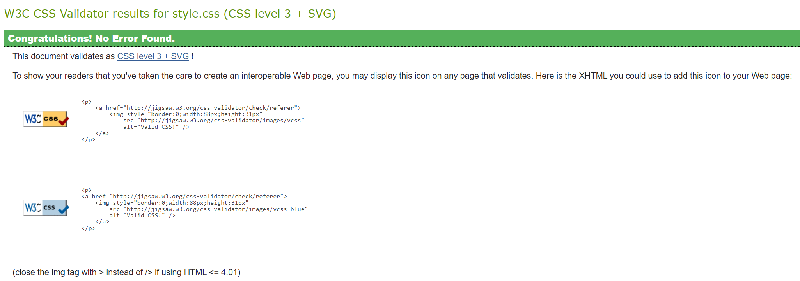

- PowerMapper 

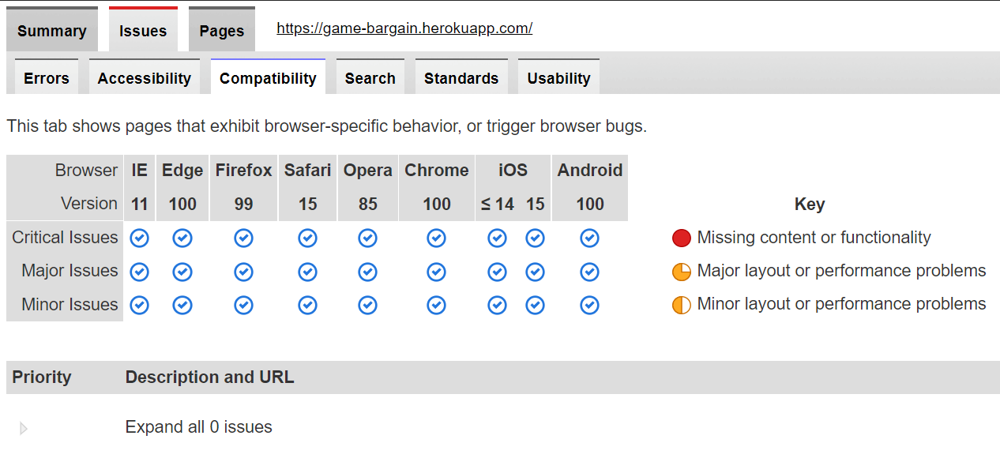

PowerMapper was used to double-check the browser compatibility.
## Testing User Stories from User Experience (UX) Section
### First Time Visitor Goals
1. As a first time visitor, I want to easily see the bargains.
    - At first glance the user can already see the bargains.
    - The bargain contains the category, name and more than 50% discount toggle
    - When expanded, the user can find more details about the bargain. 
  
2. As a first time visitor, I want to register and add my own bargain.
   - After register, the user can find the New Bargain link on NavBar and easily add a new deal.
   - The user must select a category,choose a name, image, description, link to the deal page and can turn on the toggle if the discount is more than 50%. 

### Returning Visitor Goals
1. As a Returning Visitor, I want to check new bargains.

2. As a Returning Visitor, I want to manage my added bargain.
    - When logged in, the user can manage his bargains on Profile page.

3. As a Returning Visitor, I want to be able to access your social media accounts.
    - The footer presents icons with links to the social medias.
    - Each link opens the social media in a new page.

### Frequent User Goals
1. As a Frequent User, I want to check the bargains daily.
2. As a Frequent User, I want to edit my bargain, delete when expired and report other bargains if necessary.
    - The user can delete/edit his bargain on Profile Page or finding it on Main Page.
    - If the bargain posted by another user harms the community, it is possible to report it.  

### Admin Goals
1. As an Admin User, I want to manage the Categories.
    - The Admin has access to the Manage Categories page, where he can add or delete Device Categories or Report Categories.
2. As an Admin User, I want to manage the Reports from users.
    - The Admin has access to the Reports page, where it is possible to check the reports made by users and delete it.

### Issues
- Some commands for MongoDB used on lessons were Deprecated, for instance, update() and remove().
- Had an issue with Procfile during the deployment to Heroku, file was saved as UTF-16, changed to UTF-8 to fix it.
- Using a javascript for confirmation button when deleting something. The script was deleting the wrong item, as when the pop-up was created the cache was lost. Had to properly identify the item by ID.
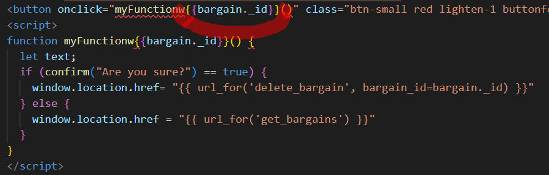

### Known Bugs

- On old devices, the images can break the layout.
- Cards and collapsible layout can break depending of text size.

## Deployment

This project was developed using Visual Studio Code Insiders, committed to git and pushed to GitHub using git bash terminal.

### Deployment to Heroku

The live link can be found here - https://game-bargain.herokuapp.com/

### Deploying on Heroku

The website was deployed to heroku by doing the following:

1. Navigate to heroku.

2. Click "new" and create a new App.

3. Give your app a name, choose your region and Click "Create app".

4. The menus that we are concerned with are "Deploy" and "Settings". Click on "Settings" First.

5. Buildpacks now need to be added. These install future dependancies that we need outside of the requirements file. The first is python and the second is node.js. Select Python first and then node.js and click save. Make sure they are in this order.

6. Then go to the deploy section and choose your deployment method. To connect with github select github and confirm.

7. Search for your repo, select it and click connect.

8. You can choose to either deploy using automatic deploys which means heroku will rebuild the app everytime you push your changes. For this option choose the branch to deploy and click enable automatic deploys. This can be changed at a later date to manual. Manual deployment deploys the current state of a branch.

9. Click deploy branch.

If successful you should be able to view your deployed app by clicking "View".

### Forking the GitHub Repository

By forking the GitHub Repository we make a copy of the original repository on our GitHub account to view and/or make changes without affecting the original repository by using the following steps.

1. Log in to GitHub and locate the GitHub Repository
2. At the top of the Repository (not top of page) just above the "Settings" Button on the menu, locate the "Fork" Button.
3. You should now have a copy of the original repository in your GitHub account.

### Making a Local Clone

1. Log in to GitHub and locate the GitHub Repository
2. Under the repository name, click "Clone or download".
3. To clone the repository using HTTPS, under "Clone with HTTPS", copy the link.
4. Open Git Bash
5. Change the current working directory to the location where you want the cloned directory to be made.
6. Type git clone, and then paste the URL you copied in Step 3.
7. Press Enter. Your local clone will be created.

## Credits

### Code

- MaterializeCSS was used through the project mainly the navbar, collapsible and the cards.
- Authentication methods, connecting to MongoDB and Heroku codes used from Codeinstitute mini project videos.
- Confirmation pop-up code in JS from [W3School](https://www.w3schools.com/).

### Media
1. images were sourced from [Unsplash](https://unsplash.com/).
  
2. All icons were sourced from [Fontawesome](https://fontawesome.com/).

3. Photoshop was used by a graphic designer to make the logo (Rodrigo Lorenzo).

### Acknowledgements
- [Tim Nelson](https://github.com/TravelTimN) for explaining in a way that makes everything easy.
- Student care and fellow students at Code Institute for their support.
- I would like to thank my friends, Diego Laterza and Rodrigo Lorenzo for their help and guidance through the process.